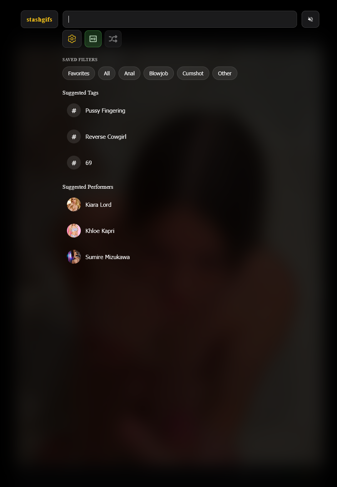

# StashGifs

A hobby project that turns your Stash scene markers / gifs and short form content into an endless scroll of looping content.

## Screenshots

###  View

*The endless scroll feed with auto-playing videos and images*

## Getting Started

Install it via Stash's plugin system using the `index.yml` file.

## Features

- Scroll through markers like a social feed
- Videos auto-play as you browse (HD videos wait for hover)
- Image support - browse images alongside videos in the feed
- Short form content - videos under 2 minutes (configurable) that play from start to end
- Click performer or tag chips to filter on the fly
- Every load gives you a fresh random mix
- Heart favorites, track o-counts, rate with stars
- Jump into full HD mode with audio
- Random scene player to discover new content and add markers on the spot
- Works on mobile too

## How to Use It

**The Feed:**
- Click any performer or tag chip to filter instantly
- Search bar opens a full-screen dropdown with trending tags and saved filters

**On Each Card:**
- Heart it to favorite the marker (adds a tag in Stash)
- Increment the o-count
- Rate the scene (0-10 stars)
- **HD** Switch to full scene with audio
- Add a marker at the current timestamp (in random mode)
- **+** Add more tags to a marker
- Open in Stash at the marker timestamp

## Settings

Access settings via the settings button in the header. You can configure:

**Images:**
- Images/gifs/webps from your Stash image library appear in the feed alongside videos
- Same interaction features as videos: heart, rate, add tags, increment o-count

**Short Form Content:**
- Scenes with a Duration less than 2 minutes (configurable)
- Play from start to end automatically - no markers needed
- Mixed into the feed alongside regular markers and images
- Can be enabled/disabled in settings

Settings are saved automatically as you change them and persist across sessions.
## For Developers

```bash
npm install
npm run build
```
## Credits

Inspired by [Stash TV](https://discourse.stashapp.cc/t/stash-tv/3627). Thanks for the idea!
